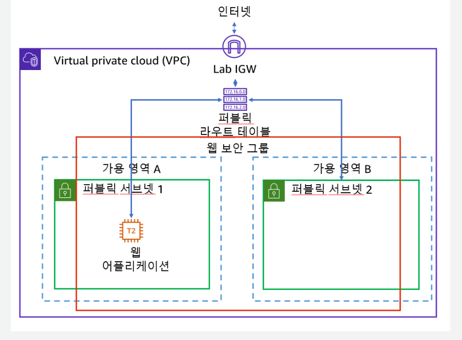

# 실습 3: Amazon S3 버킷과 Amazon DynamoDB 테이블을 사용하도록 웹 애플리케이션 구성

목표
이 실습을 완료하면 다음을 수행할 수 있습니다.

* Amazon Simple Storage Service(Amazon S3) 버킷 생성
* S3 버킷 정책 생성
* S3 버킷을 사용하도록 애플리케이션 수정
*S3 버킷에 객체 업로드
* Amazon DynamoDB 테이블 생성
* 애플리케이션 웹 인터페이스를 사용하여 애플리케이션 테스트
* AWS Management Console을 사용하여 기존 DynamoDB 항목 관리
* AWS Management Console을 사용하여 DynamoDB 테이블에서 항목 생성

## 과제 1: Amazon Simple Storage Service(Amazon S3) 버킷 생성

실습 지원을 위해 필수 리소스가 미리 생성되어 있습니다. 이러한 리소스에는 퍼블릭 서브넷 2개가 가용 영역 2개에 각각 포함되어 있는 VPC, 인터넷 게이트웨이, 인터넷으로의 경로가 포함된 라우팅 테이블, 그리고 Employee Directory 애플리케이션을 호스팅하는 EC2 인스턴스가 포함됩니다. 아래 이미지에 리소스가 대략적으로 나와 있습니

