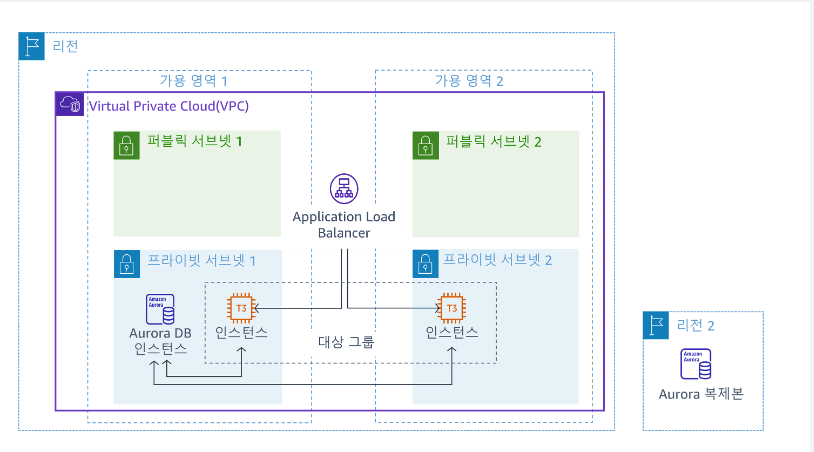

## 개요

팀이 새로운 웹 기반 애플리케이션의 아키텍처 프로토타입 생성 업무를 맡았습니다. 아키텍처를 정의하려면 로드 밸런서와 Amazon RDS 같은 관리형 데이터베이스를 더욱 자세히 파악해야 합니다.

실습 환경
실습을 시작할 수 있도록 실습 환경에서 제공되는 리소스는 Amazon Virtual Private Cloud(Amazon VPC), 필요한 기본 네트워크 구조, 인바운드 및 아웃바운드 트래픽 제어용 보안 그룹 3개, 프라이빗 서브넷의 EC2 인스턴스 2개, 관련 EC2 인스턴스 프로파일 1개입니다. 인스턴스 프로파일에는 AWS Systems Manager Session Manager 기능이 EC2 인스턴스에 액세스하도록 허용하는 데 필요한 권한이 포함되어 있습니다.

