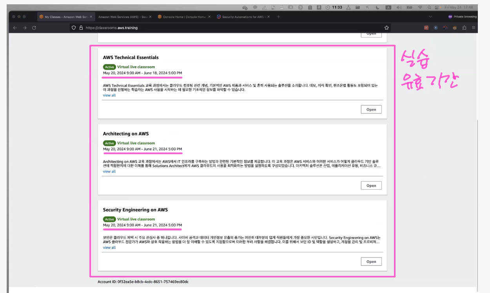

수강생 실습 URL: https://classrooms.aws.training
kabryong@amazon.com

http://bit.ly/krk_class  사전 등록이 필요합니다. 

[여기](https://candle-caravan-bc3.notion.site/faafe025dee346679fe050609ebb19d3)

https://candle-caravan-bc3.notion.site/faafe025dee346679fe050609ebb19d3



### system manager console 

```sh
sh-5.2$ aws configure list
      Name                    Value             Type    Location
      ----                    -----             ----    --------
   profile                <not set>             None    None
access_key     ****************MQ74         iam-role
secret_key     ****************tf+f         iam-role
    region           ap-southeast-2             imds
sh-5.2$
```

#### ssm-session-worker 
```
sh-5.2$ ps -ef | grep -i ssm
root        1576       1  0 01:30 ?        00:00:00 /usr/bin/amazon-ssm-agent
root        1624    1576  0 01:30 ?        00:00:00 /usr/bin/ssm-agent-worker
root        2990    1624  0 02:14 ?        00:00:00 /usr/bin/ssm-session-worker a5b0b15c-deb2-4a05-af62-fa76ea600ba0-cb47vjb52ddgsynwl32xlgjshq
ssm-user    3003    2990  0 02:14 pts/0    00:00:00 sh
ssm-user    3112    3003  0 02:19 pts/0    00:00:00 ps -ef
ssm-user    3113    3003  0 02:19 pts/0    00:00:00 grep -i ssm
```


