Amazon Web Services(AWS)는 클라우드에서 안정적이고 내결함성이 있으며 가용성이 뛰어난 시스템을 구축하기 위한 서비스와 인프라를 제공합니다. 내결함성은 시스템을 구축하는 데 사용되는 일부 구성 요소에 장애가 발생해도 계속 작동할 수 있는 시스템의 능력입니다. 고가용성은 시스템 장애를 예방하는 것이 아니라 장애에서 빠르게 복구하는 시스템의 능력입니다. AWS 솔루션스 아키텍트는 가용성이 뛰어나고 필요할 경우 내결함성을 갖춘 시스템을 설계하고 이러한 설계의 이점과 비용을 이해해야 합니다. 이 실습에서는 두 가지 유용한 AWS 서비스인 Elastic Load Balancing과 Auto Scaling 그룹을 통합합니다. 애플리케이션 서버로 작동하는 Amazon Elastic Compute Cloud(Amazon EC2) 인스턴스의 Auto Scaling 그룹을 생성한 다음, Auto Scaling 그룹 내 인스턴스 간에 부하가 균형있게 전달되도록 Application Load Balancer를 구성합니다. 계속해서 다중 AZ를 허용하고 읽기 전용 복제본을 생성한 후 승격하는 등 Amazon Relational Database Service(Amazon RDS)를 사용해 봅니다. 읽기 전용 복제본을 사용할 경우 데이터를 프라이머리 데이터베이스에 쓰고 읽기 전용 복제본에서 읽을 수 있습니다. 읽기 전용 복제본은 프라이머리 데이터베이스로 승격할 수 있으므로 고가용성과 재해 복구에 유용한 도구입니다.


## 1.VPC

### VPC 생성
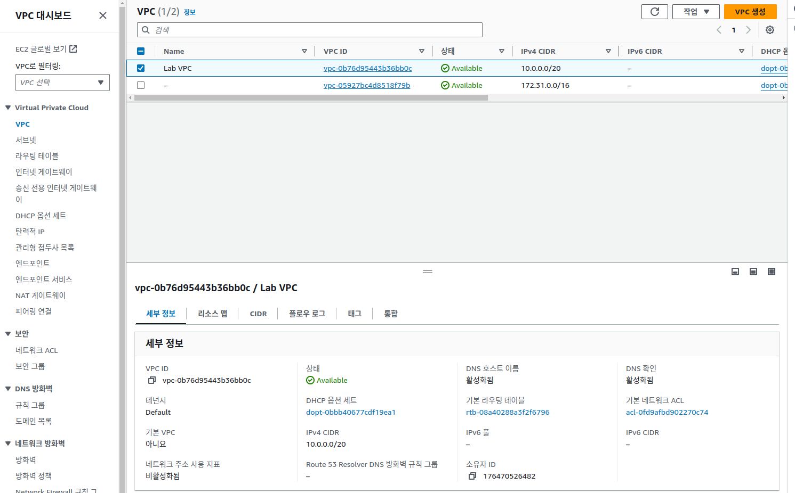

### subnet


### 라우팅 테이블
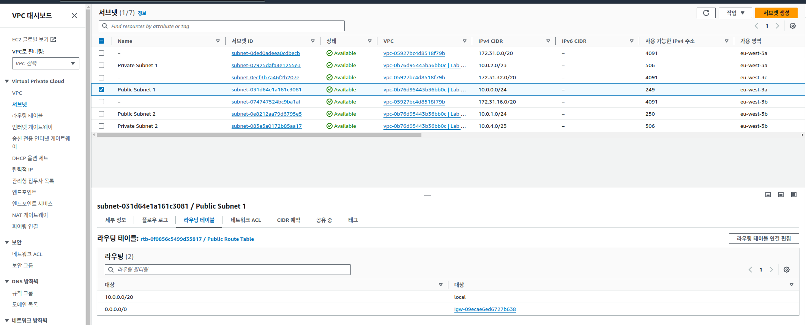


### 네트워크 ACL
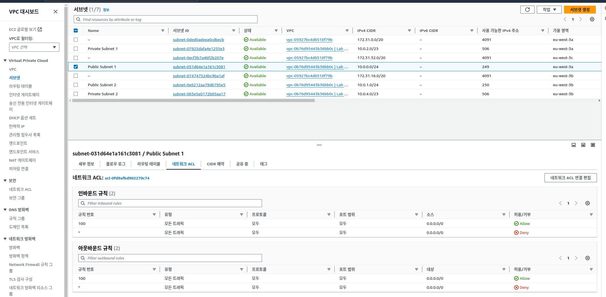

### 인터넷 게이트웨이


### 보안그룹
1. inbound
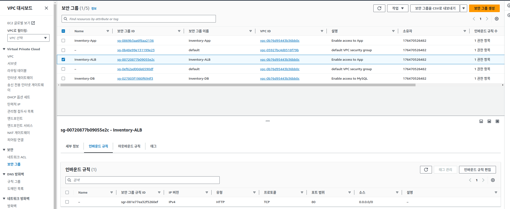
2. outbound


### DB 보안 그룹


## EC2 설정 검사

### AppServer 인스턴스


### 사용자 데이터 편집

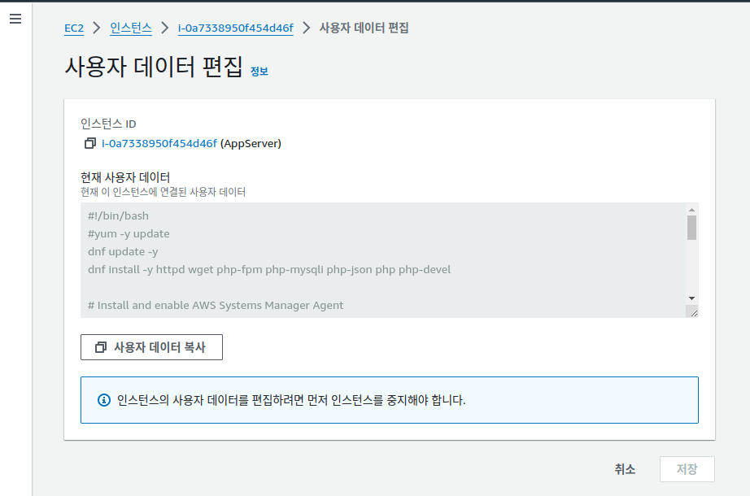

```sh
#!/bin/bash
#yum -y update
dnf update -y
dnf install -y httpd wget php-fpm php-mysqli php-json php php-devel

# Install and enable AWS Systems Manager Agent
cd /tmp
systemctl enable amazon-ssm-agent
systemctl start amazon-ssm-agent

# Download Inventory App Lab files
wget https://eu-west-3-tcprod.s3.eu-west-3.amazonaws.com/courses/ILT-TF-200-ARCHIT/v7.7.3.prod-f959cb1c/lab-4-HA/scripts/inventory-app.zip
unzip inventory-app.zip -d /var/www/html/

# Download and install the AWS SDK for PHP
wget https://github.com/aws/aws-sdk-php/releases/download/3.295.2/aws.zip
unzip aws -d /var/www/html
unzip /var/www/html/aws.zip -d /var/www/html/

# Load Amazon Aurora DB connection details from AWS CloudFormation
un="dbadmin"
pw="lab-password"
ep="inventory-cluster.cluster-ceish0e2ysws.eu-west-3.rds.amazonaws.com"
db="inventory"

# Populate PHP app settings with DB info
sed -i "s/DBENDPOINT/$ep/g" /var/www/html/get-parameters.php
sed -i "s/DBNAME/$db/g" /var/www/html/get-parameters.php
sed -i "s/DBUSERNAME/$un/g" /var/www/html/get-parameters.php
sed -i "s/DBPASSWORD/$pw/g" /var/www/html/get-parameters.php

# Turn on web server
systemctl start httpd.service
systemctl enable httpd.service
```
## 2. 로드 밸런서 검사

### Target group


### LB 검사 


## 인스턴스 템플릿 생성

### 템플릿 생성
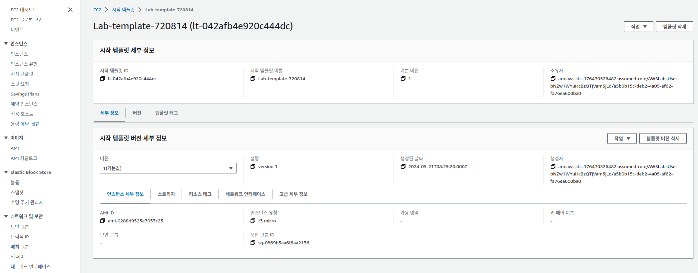


## 3. Auto Scaling  그룹 생성 

이 과제에서는 프라이빗 서브넷에 EC2 인스턴스를 배포하는 Auto Scaling 그룹을 생성합니다. 프라이빗 서브넷의 인스턴스는 인터넷에서 액세스할 수 없기 때문에 애플리케이션을 배포할 때는 이것이 보안 모범 사례입니다. 대신 사용자가 Application Load Balancer에 요청을 보내면 다음 다이어그램과 같이 해당 요청이 프라이빗 서브넷에 있는 EC2 인스턴스에 전달됩니다.


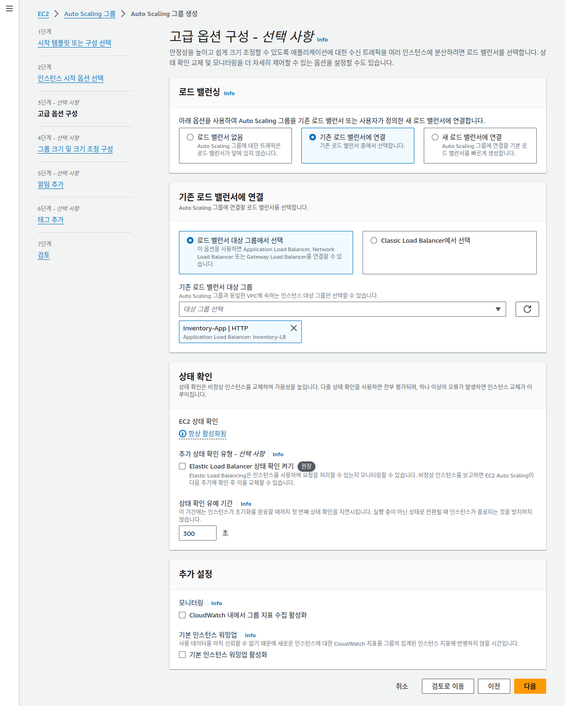


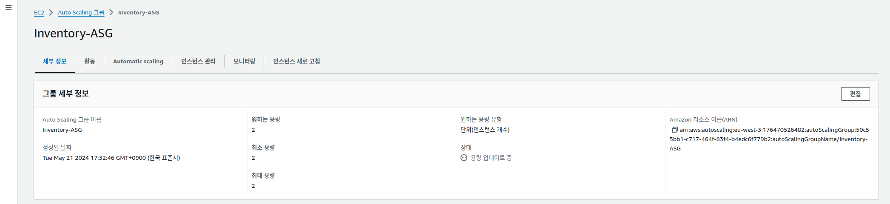


## 4. 어플리케이션 테스트

1. target group  확인 
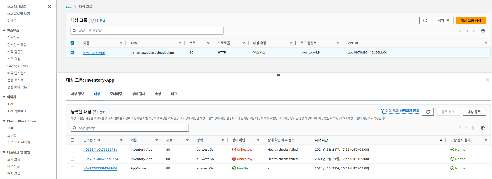
Registered targets 섹션에 3개의 인스턴스가 있습니다. 여기에는 이름이 Inventory-App인 Auto Scaling 인스턴스 2개와 과제 1에서 검사한 AppServer라는 원래 인스턴스가 포함됩니다. Health Status 열에는 인스턴스에 대해 수행한 로드 밸런서 상태 확인 결과가 표시됩니다. 이 과제에서는 대상 그룹에서 원래 AppServer 인스턴스를 제거하고 Amazon EC2 Auto Scaling이 관리하는 2개의 인스턴스만 남깁니다.
2. 등록 취소 


## ELB에서 health check 
* EC2 autoScale 에서도 health check : 2by2 (elb)
* ELB에서도 health check  : Application 상태
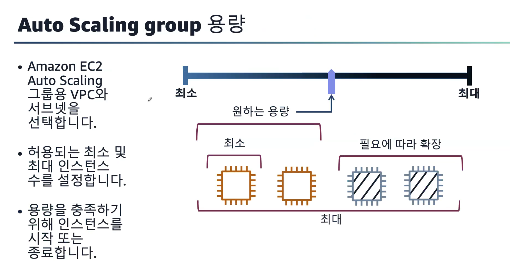

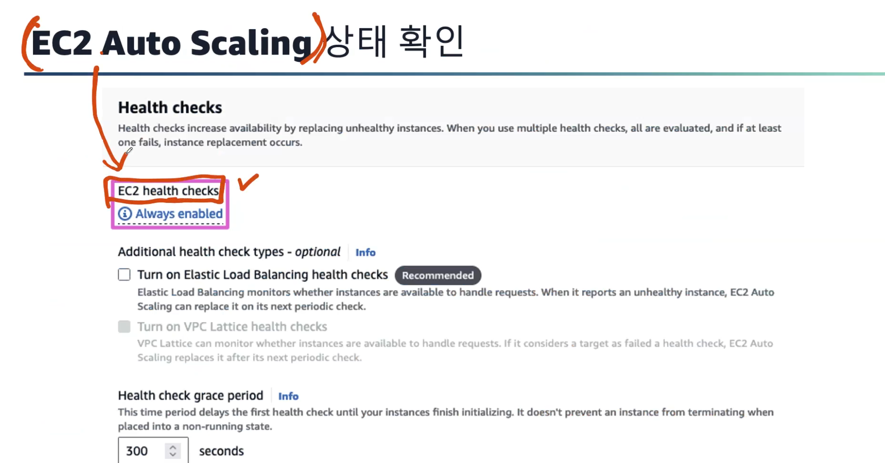


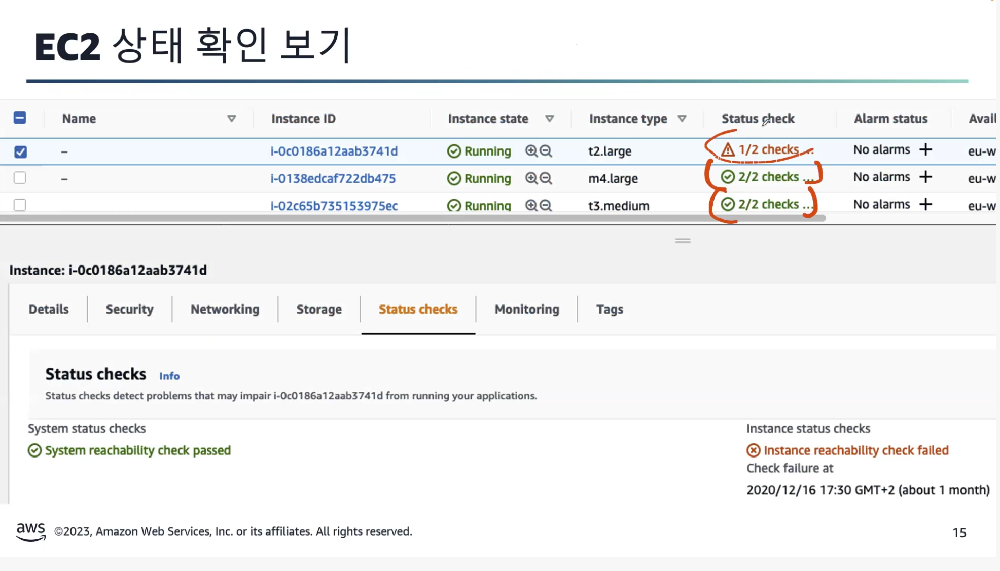

### ELB vs EC2 Auto Acaling 


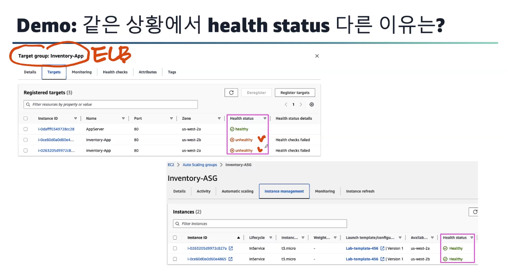
* application은 문제가 있고
* EC2 시스템은 정상 상황 
=> launch template를 수정해서 V1, V2, V3  에서 V2를 가르키도록 수정 


### ELB와 ASG 결합한 상황
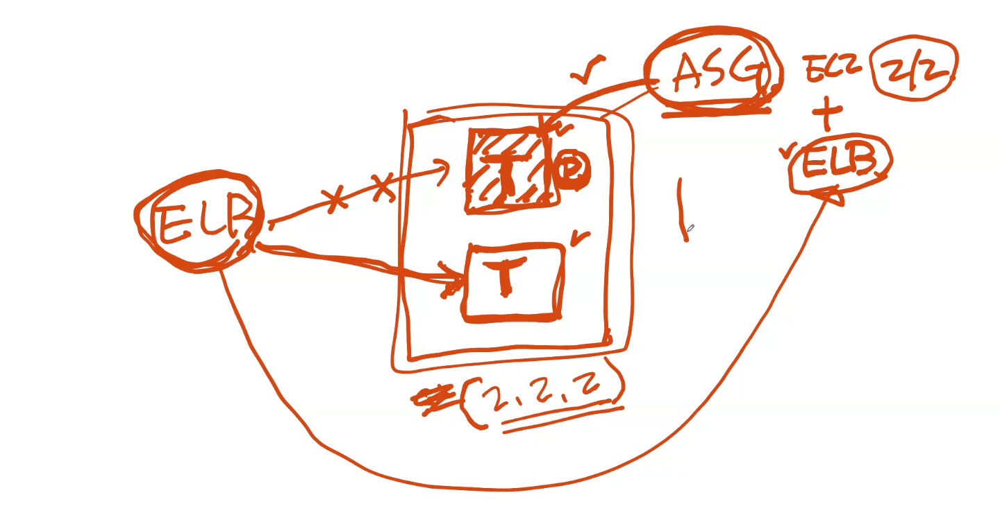


