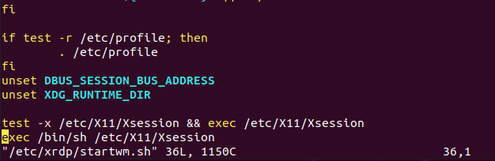

# Ubuntu Set up

## xrdp

### install 

```
$ sudo apt install ubuntu-desktop
$ sudo adduser xrdp ssl-cert
$ sudo ufw allow from 192.168.2.0/24 to any port 3389
$ sudo ufw reload
$ sudo ufw status
```

 Ubuntu 바탕 화면 배경 대신 검은 색 빈 화면이 나타날 수 있습니다.

```
$ sudo vim /etc/xrdp/startwm.sh
아래 스크린 샷과 같이 Xsession을 테스트하고 실행하는 줄 바로 앞에이 줄을 추가합니다.

unset DBUS_SESSION_BUS_ADDRESS
unset XDG_RUNTIME_DIR

$ sudo systemctl restart xrdp
```




## user 

#### group add

```
$ sudo groupadd foo
$ sudo groupadd bar
$ cat /etc/group
```

```
# id 명령으로 현재 설정된 id 정보나 group 정보를 알 수 있다.
$ sudo id leocat
uid=1000(leocat) gid=1000(leocat) groups=1000(leocat)

# -G 옵션으로 secondary group으로 foo 설정
$ sudo usermod -G foo leocat
$ sudo id leocat
uid=1000(leocat) gid=1000(leocat) groups=1000(leocat),10000(foo)

# -a 옵션으로 secondary group을 추가할 수 있다. (append)
$ sudo usermod -G foo -a leocat
$ sudo id leocat
uid=1000(leocat) gid=1000(leocat) groups=1000(leocat),10000(foo),10001(bar)

# 콤마(,)를 이용해서 여러 group을 지정할 수 있다.
$ sudo usermod -G foo,bar leocat
$ sudo id leocat
uid=1000(leocat) gid=1000(leocat) groups=1000(leocat),10000(foo),10001(bar)

# group을 제거하면 user에 추가되어 있던 group도 제거된다.
$ sudo groupdel bar
[leocat@my-test ~]$ sudo id leocat
uid=1000(leocat) gid=1000(leocat) groups=1000(leocat),10000(foo)
```

